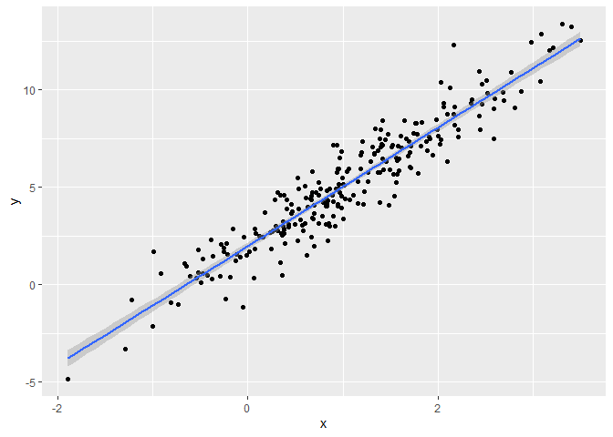
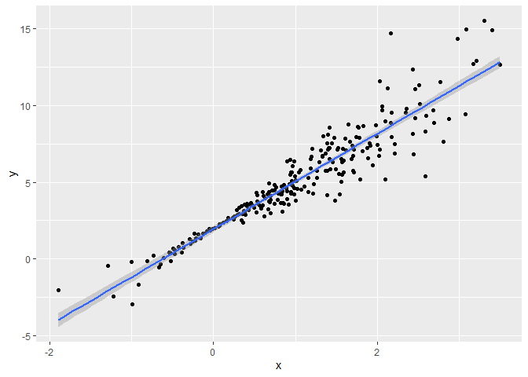
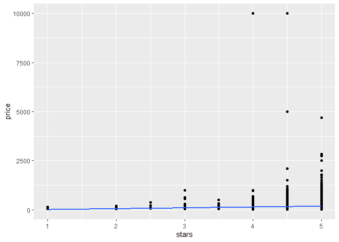
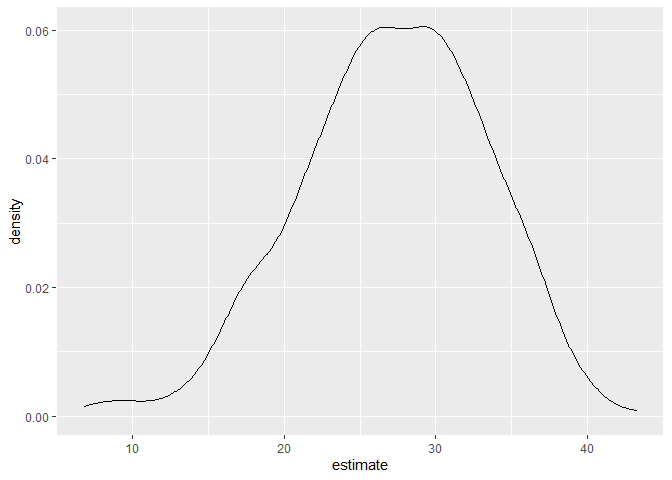

Bootstrap
================
ak5357
2024-11-14

Do some bootstrapping!

Make up some data.

``` r
n_samp = 250

sim_df_constant =
  tibble(
    x = rnorm(n_samp, 1, 1),
    error = rnorm(n_samp, 0, 1),
    y = 2 + 3 * x + error
  )

sim_df_nonconstant =
  sim_df_constant |> 
  mutate(
    error = error * .75 * x,
    y = 2 + 3 * x + error
  )
```

Let’s look at these.

``` r
sim_df_constant |> 
  ggplot(aes(x = x, y = y)) +
  geom_point() +
  stat_smooth(method = "lm")
```

    ## `geom_smooth()` using formula = 'y ~ x'

<!-- -->

``` r
sim_df_nonconstant |> 
  ggplot(aes(x = x, y = y)) +
  geom_point() +
  stat_smooth(method = "lm")
```

    ## `geom_smooth()` using formula = 'y ~ x'

<!-- -->

Look at regression results. Moral of the story: Can’t always trust
p-values.

``` r
sim_df_constant |> 
  lm(y ~ x, data = _) |> 
  broom::tidy() |> 
  knitr::kable(digits = 3)
```

| term        | estimate | std.error | statistic | p.value |
|:------------|---------:|----------:|----------:|--------:|
| (Intercept) |    1.977 |     0.098 |    20.157 |       0 |
| x           |    3.045 |     0.070 |    43.537 |       0 |

``` r
sim_df_nonconstant |> 
  lm(y ~ x, data = _) |> 
  broom::tidy() |> 
  knitr::kable(digits = 3)
```

| term        | estimate | std.error | statistic | p.value |
|:------------|---------:|----------:|----------:|--------:|
| (Intercept) |    1.934 |     0.105 |    18.456 |       0 |
| x           |    3.112 |     0.075 |    41.661 |       0 |

## Draw a bootstrap sample.

- replace = TRUE means that points can be re-selected in the bootstrap
  sample.

``` r
boot_sample = function(df){
  boot_df = 
    sample_frac(df, replace = TRUE) |> 
    arrange(x)
  
  return(boot_df)
}
```

Let’s try running this!

``` r
sim_df_nonconstant |>
  boot_sample() |> 
  ggplot(aes(x = x, y = y)) +
  geom_point(alpha = 0.5) +
  stat_smooth(method = "lm")
```

    ## `geom_smooth()` using formula = 'y ~ x'

<!-- -->

Can we do this as part of an anlysis?

``` r
sim_df_nonconstant |> 
  boot_sample() |> 
  lm(y ~ x, data = _) |> 
  broom::tidy() |> 
  knitr::kable(digits = 3)
```

| term        | estimate | std.error | statistic | p.value |
|:------------|---------:|----------:|----------:|--------:|
| (Intercept) |    1.896 |     0.098 |    19.311 |       0 |
| x           |    3.142 |     0.069 |    45.636 |       0 |

## Bootstrap A LOT

We see that the final estimates, after using 1000 samples, have more
certainty in the intercept and less certainty in the slope–which
reflects the fact that there’s more variation farther away from x = 0.
This is how the bootstrap simulation works in our benefit.

``` r
boot_straps =
  tibble(
    strap_number = 1:1000
  ) |> 
  mutate(
    strap_sample = map(strap_number, \(i) boot_sample(df = sim_df_nonconstant)),
    models = map(strap_sample, \(df) lm(y ~ x, data = df)),
    results = map(models, broom::tidy)
  )

bootstrap_results = 
  boot_straps |> 
  select(strap_number, results) |> 
  unnest(results) |> 
  group_by(term) |> 
  summarize(
    boot_se = sd(estimate)
  ) |> 
  knitr::kable(digits = 3)

bootstrap_results
```

| term        | boot_se |
|:------------|--------:|
| (Intercept) |   0.075 |
| x           |   0.101 |

## 

``` r
boot_straps = 
  sim_df_nonconstant |> 
  modelr::bootstrap(1000) |> 
  mutate(
    strap = map(strap, as_tibble),
    models = map(strap, \(df) lm(y ~ x, data = df)),
    results = map(models, broom::tidy)
  ) |> 
  select(.id, results) |> 
  unnest(results)

boot_straps
```

    ## # A tibble: 2,000 × 6
    ##    .id   term        estimate std.error statistic   p.value
    ##    <chr> <chr>          <dbl>     <dbl>     <dbl>     <dbl>
    ##  1 0001  (Intercept)     1.90    0.101       18.8 1.05e- 49
    ##  2 0001  x               3.11    0.0774      40.2 1.27e-110
    ##  3 0002  (Intercept)     1.87    0.0944      19.8 5.17e- 53
    ##  4 0002  x               3.24    0.0667      48.6 1.13e-128
    ##  5 0003  (Intercept)     2.01    0.115       17.5 2.87e- 45
    ##  6 0003  x               2.96    0.0776      38.1 1.38e-105
    ##  7 0004  (Intercept)     1.91    0.114       16.7 1.31e- 42
    ##  8 0004  x               3.12    0.0818      38.1 1.03e-105
    ##  9 0005  (Intercept)     1.92    0.109       17.7 8.68e- 46
    ## 10 0005  x               3.05    0.0748      40.8 4.45e-112
    ## # ℹ 1,990 more rows

## What do you want to report

``` r
boot_straps |> 
  group_by(term) |> 
  summarize(
    boot_est = mean(estimate),
    boot_se = sd(estimate),
    boot_ci_ll = quantile(estimate, .025),
    boot_ci_ul = quantile(estimate, .975)
  )
```

    ## # A tibble: 2 × 5
    ##   term        boot_est boot_se boot_ci_ll boot_ci_ul
    ##   <chr>          <dbl>   <dbl>      <dbl>      <dbl>
    ## 1 (Intercept)     1.93  0.0762       1.79       2.08
    ## 2 x               3.11  0.104        2.92       3.32

## Air BNB

``` r
data("nyc_airbnb")

manhattan_df = 
  nyc_airbnb |> 
  mutate(stars = review_scores_location / 2) |> 
  rename(borough = neighbourhood_group, neighborhood = neighbourhood) |> 
  filter(borough == "Manhattan") |> 
  select(price, stars, room_type) |> 
  drop_na()
```

Plot the data.

``` r
manhattan_df |> 
  ggplot(aes(x = stars, y = price)) +
  geom_point() +
  stat_smooth(method = "lm", se = FALSE)
```

    ## `geom_smooth()` using formula = 'y ~ x'

<!-- -->

Fit a regression.

``` r
manhattan_df |> 
  lm(price ~ stars + room_type, data = _) |> 
  broom::tidy() |> 
  knitr::kable(digits = 3)
```

| term                  | estimate | std.error | statistic | p.value |
|:----------------------|---------:|----------:|----------:|--------:|
| (Intercept)           |   95.694 |    22.186 |     4.313 |       0 |
| stars                 |   27.110 |     4.585 |     5.913 |       0 |
| room_typePrivate room | -124.188 |     3.464 |   -35.848 |       0 |
| room_typeShared room  | -153.635 |    10.052 |   -15.285 |       0 |

Bootstrap for a better inference.

``` r
boot_results = manhattan_df |> 
  modelr::bootstrap(1000) |> 
  mutate(
    strap = map(strap, as_tibble),
    models = map(strap, \(df) lm(price ~ stars + room_type, data = df)),
    results = map(models, broom::tidy)
  ) |> 
  select(.id, results) |> 
  unnest(results)

boot_results |> 
  filter(term == "stars") |> 
  ggplot(aes(x = estimate)) +
  geom_density()
```

<!-- -->

``` r
boot_results |> 
  group_by(term) |> 
  summarize(
    boot_est = mean(estimate),
    boot_se = sd(estimate),
    boot_ci_ll = quantile(estimate, .025),
    boot_ci_ul = quantile(estimate, .975)
  )
```

    ## # A tibble: 4 × 5
    ##   term                  boot_est boot_se boot_ci_ll boot_ci_ul
    ##   <chr>                    <dbl>   <dbl>      <dbl>      <dbl>
    ## 1 (Intercept)               95.3   30.4        43.8      157. 
    ## 2 room_typePrivate room   -124.     3.31     -130.      -118. 
    ## 3 room_typeShared room    -154.     3.06     -159.      -148. 
    ## 4 stars                     27.2    6.14       15.1       37.6
